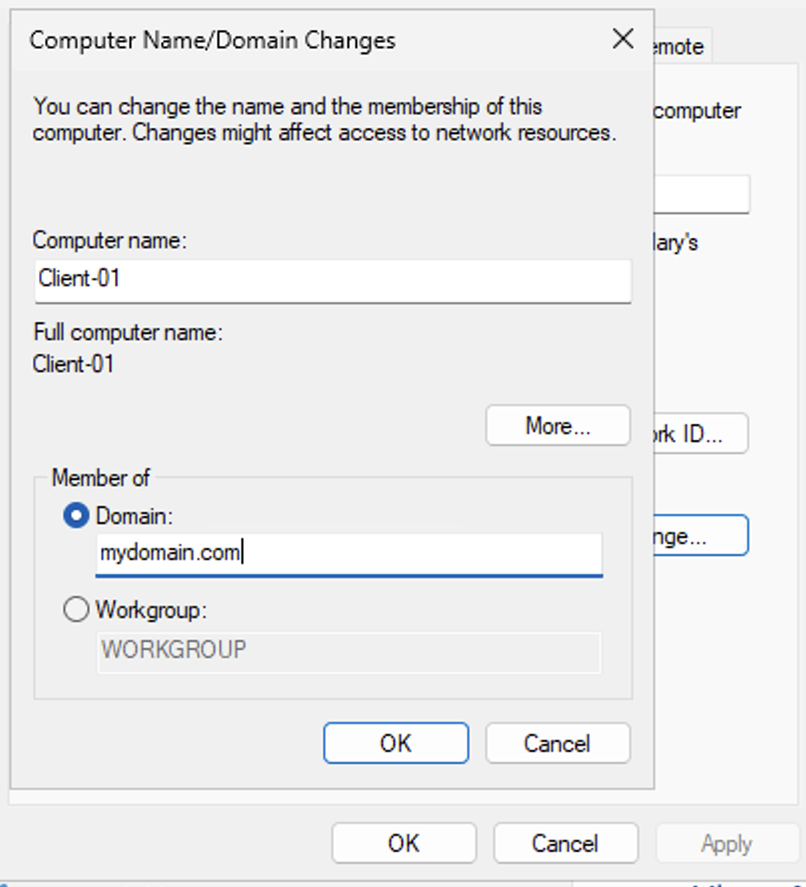
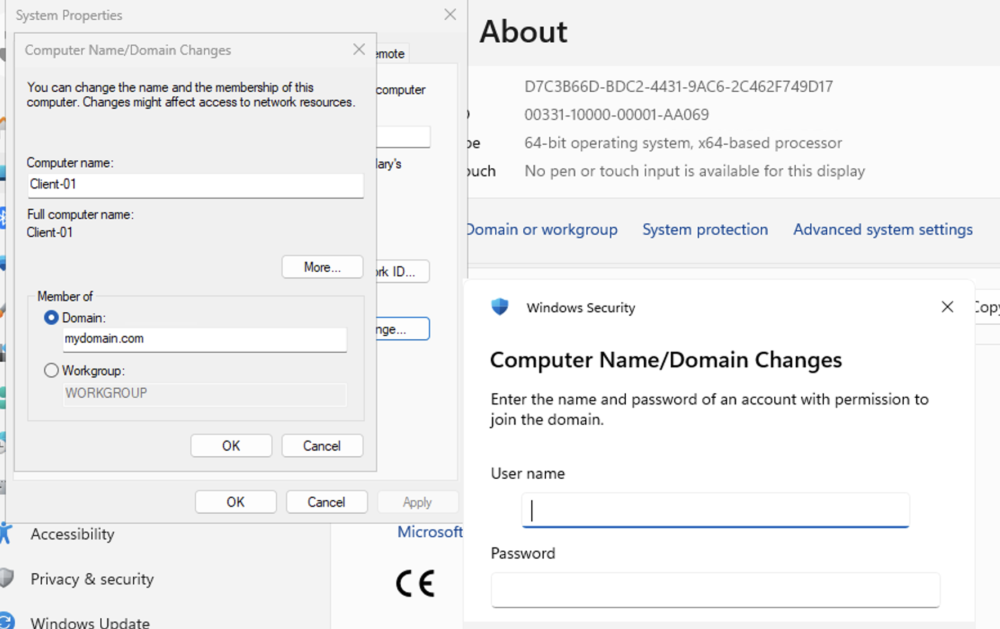
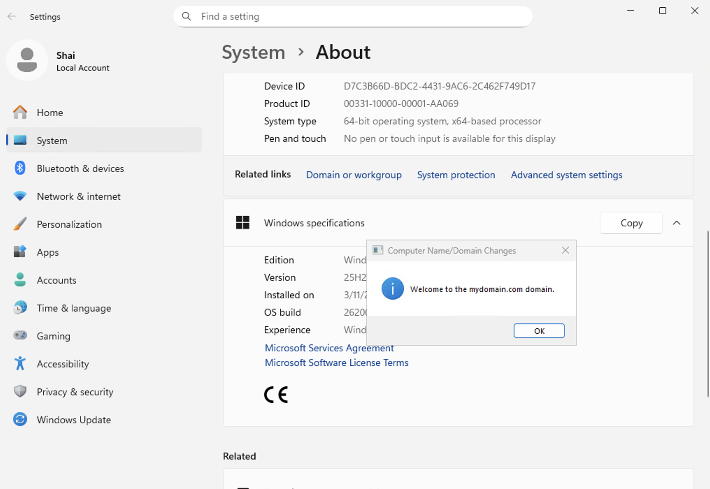
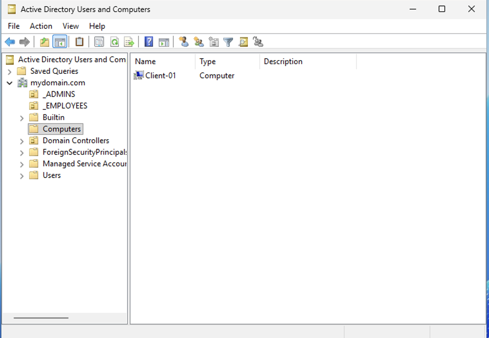
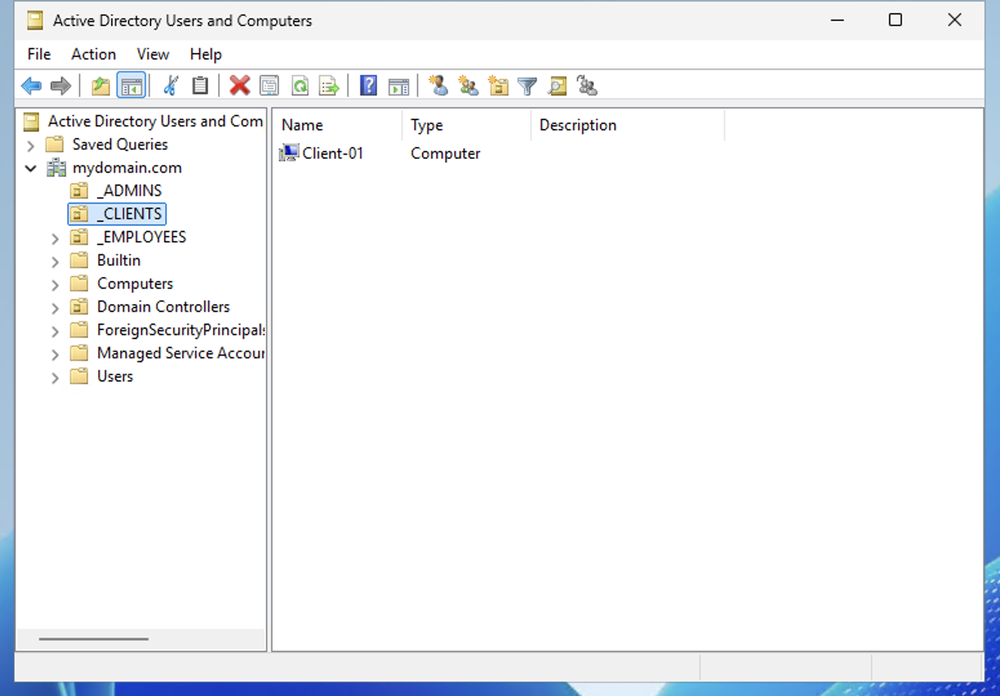
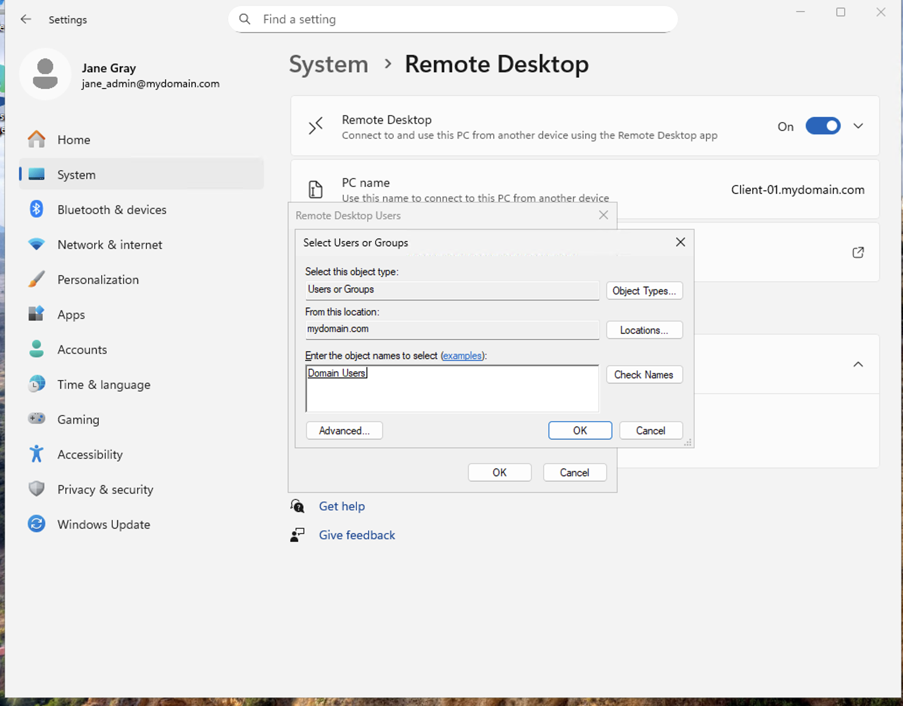
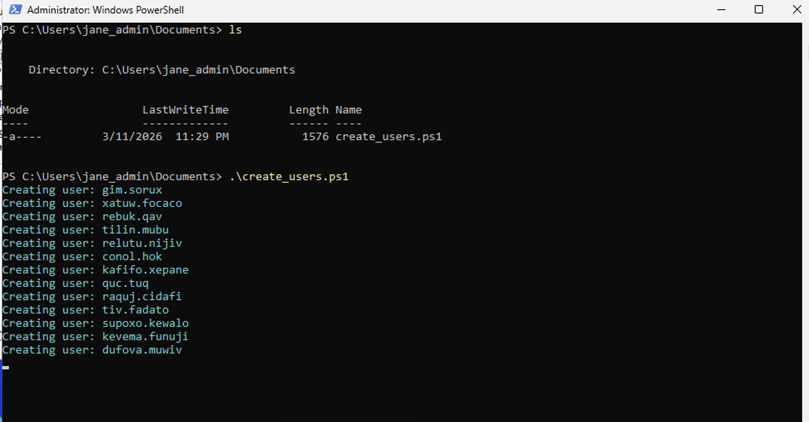
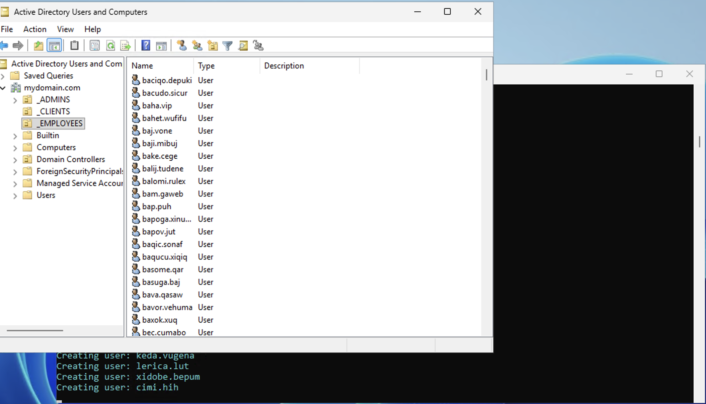
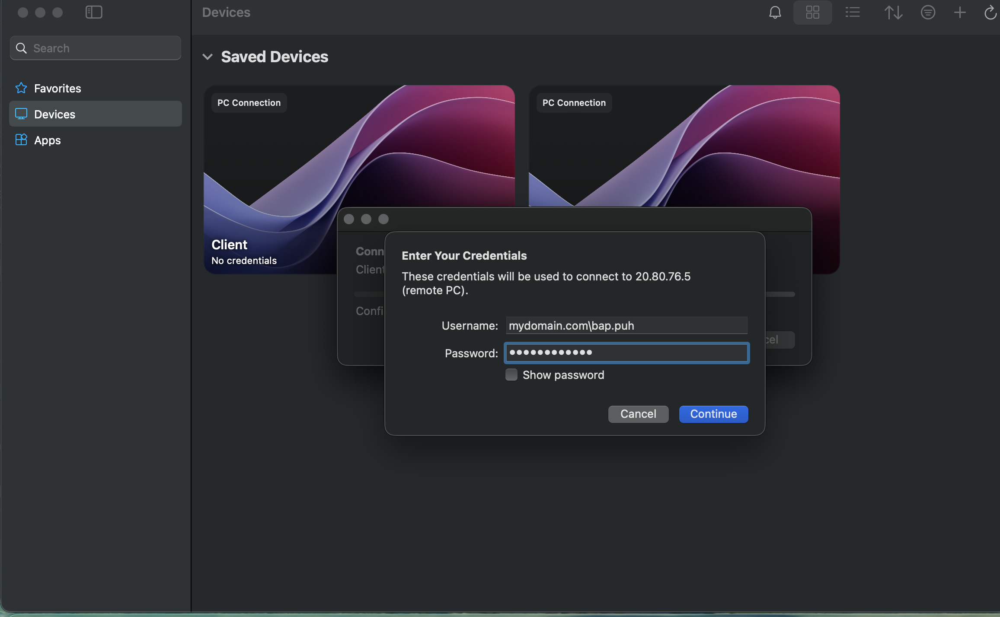
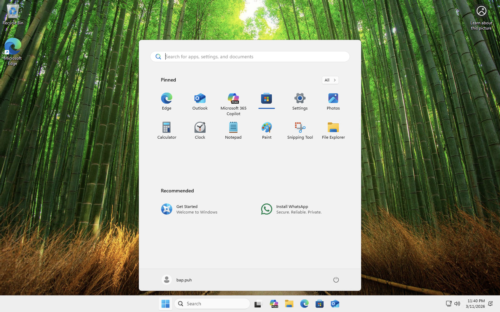

 

<h2>Creating Domain Admins and Domain Users</h2>

After deploying Active Directory, administrators can begin organizing the directory structure and creating domain users. In this lab, Organizational Units (OUs) are created to separate administrative accounts from regular employee accounts.

 

<h3>Creating Organizational Units</h3>

Within the <strong>Active Directory Users and Computers</strong> console, right-click the domain and navigate to:

<strong>New → Organizational Unit</strong>

Organizational Units allow administrators to logically organize users, computers, and other objects within the domain. This structure is commonly used in enterprise environments to separate departments, administrative accounts, and security policies.

 

<h3>Creating Admin and Employee Containers</h3>

Two Organizational Units are created to organize accounts within the environment.

The following OUs are created:

<ul>
<li><strong>_ADMINS</strong> – used to store domain administrator accounts</li>
<li><strong>_EMPLOYEES</strong> – used to store standard domain user accounts</li>
</ul>

This structure allows administrators to apply different security policies and permissions to different groups of users.

 

<h3>Creating a New Domain Administrator</h3>

Next, a domain administrator account is created inside the <strong>_ADMINS</strong> organizational unit.

Right-click the <strong>_ADMINS</strong> OU and select:

<strong>New → User</strong>

The administrator account is configured with the name <strong>Jane Gray</strong>.

 

<h3>Verifying the New Administrator Account</h3>

After completing the user creation wizard, the new account appears inside the <strong>_ADMINS</strong> organizational unit.

At this stage, the account exists in Active Directory but does not yet have administrative privileges.

 

<h3>Granting Domain Administrator Privileges</h3>

To grant administrative permissions, the user must be added to the <strong>Domain Admins</strong> security group.

Open the user properties and navigate to the <strong>Member Of</strong> tab.

The account is added to the following groups:

<ul>
<li>Domain Admins</li>
<li>Domain Users</li>
</ul>

Membership in the <strong>Domain Admins</strong> group provides full administrative control across the Active Directory domain.

 

<h3>Logging in with the New Domain Administrator</h3>

After the administrator account is created, it can be used to log into domain-joined systems. The login format uses the domain name followed by the username.

Example login format:

<pre>
mydomain.com\jane_admin
</pre>

Successful authentication confirms that the Active Directory domain controller is functioning correctly and that domain accounts can authenticate to systems within the environment.

 

<h3>Lab Outcome</h3>

At this stage the Active Directory environment now includes:

<ul>
<li>A functional Domain Controller</li>
<li>Organizational Units for administrative and employee accounts</li>
<li>A domain administrator account</li>
<li>Working domain authentication</li>
</ul>

This environment can now be expanded by joining client machines to the domain and generating additional user accounts to simulate a real enterprise network.

<h2>
  
  Joining the Client Computer to the Domain
</h2>

This section walks through how the client machine is joined to the Active Directory domain that was created on the Domain Controller. 
Once a computer joins the domain, it can authenticate with domain accounts instead of only using local accounts on that machine.
This is important in enterprise environments because it allows centralized management, easier user access control, and domain-based authentication across multiple systems.

At this stage of the lab, the Domain Controller has already been configured and the <strong>mydomain.com</strong> domain already exists.
Now the goal is to connect the client workstation to that domain so it becomes part of the Active Directory environment.

<h3>Step 1: Change the Client from a Workgroup Member to a Domain Member</h3>

On the client machine, open the system settings that allow you to rename the computer or change its network membership.
This brings up the <strong>Computer Name/Domain Changes</strong> window.

In this screen, the workstation name is shown as <strong>Client-01</strong>.
Under the <strong>Member of</strong> section, select <strong>Domain</strong> instead of <strong>Workgroup</strong>.
Then enter the domain name:

<pre>mydomain.com</pre>

This tells Windows that instead of operating as an isolated standalone machine, the computer should attempt to join and trust the Active Directory domain managed by the Domain Controller.

After clicking <strong>OK</strong>, Windows begins the process of contacting the Domain Controller to request domain membership.

<h3>Step 2: Authenticate with an Account That Has Permission to Join the Domain</h3>

After entering the domain name, Windows prompts for credentials.
This happens because only authorized domain accounts can add computers to the domain.
If anyone could join machines freely, it would create a major security issue.

The credentials entered here must belong to an account with permission to join computers to <strong>mydomain.com</strong>.
In most beginner labs, this is usually the domain admin account or another account that has been delegated permission to add machines.

This credential prompt is asking for:

<ul>
  <li><strong>User name</strong> of an authorized domain account</li>
  <li><strong>Password</strong> for that account</li>
</ul>

Once valid credentials are entered, the Domain Controller verifies them and processes the domain join request.

This is the trust step between the workstation and Active Directory.
If the username, password, DNS settings, or network connectivity are wrong, the join will fail here.

<h3>Step 3: Confirm the Client Successfully Joined the Domain</h3>

If the authentication is successful and the Domain Controller accepts the request, Windows displays a confirmation message:

<pre>Welcome to the mydomain.com domain.</pre>

This is an important confirmation because it tells us the client has successfully communicated with the Domain Controller and has now become a recognized member of the domain.

At this point, the client is not fully finished yet.
A restart is normally required so Windows can reload its identity and apply the domain membership correctly.

<h3>Step 4: Verify the Client Computer Appears in Active Directory</h3>

After the client joins the domain, go back to the Domain Controller and open <strong>Active Directory Users and Computers</strong>.
Under the domain tree, open the default <strong>Computers</strong> container.

This container is where domain-joined computer objects are often placed automatically if they have not yet been moved into a separate Organizational Unit.

Here we can now see the client machine listed as:

<pre>Client-01</pre>

That object represents the workstation inside Active Directory.
This confirms the Domain Controller now knows about the machine and can manage it as a domain asset.

This matters because once the computer object exists in Active Directory, administrators can apply policies, move the computer into OUs, and manage its access and configuration more easily.

<h3>Step 5: Move the Client into a Dedicated Clients Organizational Unit</h3>

To keep Active Directory organized, it is best practice to separate different types of objects into their own Organizational Units, or <strong>OUs</strong>.
Instead of leaving workstations in the default <strong>Computers</strong> container, we move them into a dedicated OU.

In this lab, a new OU named <strong>_CLIENTS</strong> is used.
After moving the computer object, <strong>Client-01</strong> now appears inside that OU.

This is useful because OUs let administrators:

<ul>
  <li>Apply Group Policy to only certain machines</li>
  <li>Separate client systems from servers or admin accounts</li>
  <li>Keep the directory structure clean and easier to manage</li>
</ul>

So instead of mixing computers, users, and admins together, the domain stays structured in a way that reflects how real enterprise environments are usually organized.

<h3>Step 6: Allow Domain Users to Access the Client Through Remote Desktop</h3>

After the client has joined the domain, the next task is to make it easier for domain users to remotely access the machine.
This is done by configuring Remote Desktop permissions.

In the <strong>Remote Desktop Users</strong> selection window, the group:

<pre>Domain Users</pre>

is added.

This means authenticated users from the domain are now allowed to log into the client using Remote Desktop, assuming firewall rules and connectivity are already configured properly.

This is a practical enterprise-style step because it allows users who are managed by Active Directory to sign into the workstation without needing separate local user accounts on that machine.

<h2>
  
  Generating Domain Users and Verifying User Logon
</h2>

This section continues the Active Directory lab by showing how a batch of regular domain users is generated, how those users appear inside the Employees organizational unit, and how one of those generated accounts can successfully sign in to the domain-joined client computer.
This is an important part of the lab because it moves Active Directory from just having the domain and administrative accounts set up to actually managing many user accounts the way a real organization would.

At this point in the environment:

<ul>
  <li>The Domain Controller is already configured</li>
  <li>The <strong>mydomain.com</strong> domain already exists</li>
  <li>The client machine has already joined the domain</li>
  <li>The client has already been placed into the proper organizational unit</li>
</ul>

Now the focus shifts to creating many normal employee user accounts and proving that one of those users can actually log on to the client machine.

<h3>Step 1: Confirm the User Creation Script Exists and Run It</h3>

Here, the administrator is signed in as <strong>jane_admin</strong> and is working inside PowerShell.
The current directory shown is:

<pre>C:\Users\jane_admin\Documents</pre>

The <strong>ls</strong> command is used first to list the files in that folder.
This confirms that the script file <strong>create_users.ps1</strong> is present before trying to run it.
This is a good beginner habit because it verifies that the script is actually in the current directory and avoids running a command blindly.

After confirming the script exists, it is executed with:

<pre>.\create_users.ps1</pre>

The <strong>.\</strong> at the beginning tells PowerShell to run the script from the current folder.
As the script executes, PowerShell begins printing messages such as:

<pre>
Creating user: gim.sorux
Creating user: xatuw.focaco
Creating user: rebuk.qav
...
</pre>

These lines indicate that the script is automatically generating and adding multiple user accounts into Active Directory.
In a real environment, administrators often automate repetitive account creation tasks instead of manually creating each user one at a time.
This saves time, reduces mistakes, and makes it easier to create large groups of users.

For beginners, the key takeaway here is that PowerShell is being used as an automation tool.
Instead of creating one employee at a time through the graphical interface, the script quickly creates many users in bulk.

<h3>Step 2: Verify the New Users Appear in the _EMPLOYEES Organizational Unit</h3>

After the script runs, the next step is to verify that the accounts were actually created inside Active Directory.
This is done by opening <strong>Active Directory Users and Computers</strong> and selecting the <strong>_EMPLOYEES</strong> organizational unit.

Inside that OU, a large list of newly generated user accounts is visible.
Examples shown include usernames such as:

<pre>
bacigo.depuki
bacudo.sicur
baha.vip
bahet.wufifu
baj.vone
...
</pre>

This confirms that the PowerShell script did not just print names to the screen, but actually created real domain user accounts in Active Directory.

This step is very important in a beginner walkthrough because verification matters just as much as execution.
If the script had errors, permission problems, or an incorrect OU path, the users might not appear where expected.
Seeing the accounts inside <strong>_EMPLOYEES</strong> proves the automation worked correctly.

It also reinforces an important Active Directory concept:

<ul>
  <li><strong>Users</strong> can be organized into OUs for structure and easier management</li>
  <li>The <strong>_EMPLOYEES</strong> OU is being used to group normal employee accounts together</li>
  <li>This makes future policy management, searching, and delegation much easier</li>
</ul>

<h3>Step 3: Use One of the Generated Domain User Accounts to Sign In</h3>

After confirming the generated users exist in Active Directory, the next step is to prove that they are usable accounts by logging into the client machine with one of them.

In the Windows App RDP credential prompt, the user enters one of the generated domain accounts using domain format:

<pre>mydomain.com\bap.puh</pre>

This format tells Windows to authenticate the account against the <strong>mydomain.com</strong> domain rather than using a local account on the machine.

This is a major milestone in the lab.
It proves that:

<ul>
  <li>The user account exists</li>
  <li>The domain can authenticate that user</li>
  <li>The client machine trusts the domain</li>
  <li>The user has enough access to sign in through Remote Desktop</li>
</ul>

For beginners, this is where all the earlier setup starts coming together.
The domain join, DNS configuration, user creation, and Remote Desktop permissions all work together to allow this login to happen.

<h3>Step 4: Watch the User's First Domain Sign-In Complete</h3>

After the credentials are accepted, Windows begins signing in as the generated user <strong>bap.puh</strong>.
The welcome screen appears while Windows prepares the profile for that account.

This first sign-in is often slower than future logins because Windows is creating the user’s local profile for the first time on that workstation.
That includes setting up the user directory, desktop profile, and other per-user settings.

This is another critical proof point in the lab.
It shows the account is not just visible in Active Directory, but is actually functional as a domain user account.

<h3>Step 5: Verify the User Reaches the Desktop Successfully</h3>

Once the logon finishes, the user reaches the Windows desktop.
The Start menu shows the currently signed-in account as <strong>bap.puh</strong>.
This confirms the user session is fully active and the sign-in completed successfully.

At this point, the lab has demonstrated that a generated employee account can:

<ul>
  <li>Exist inside Active Directory</li>
  <li>Be located in the proper OU</li>
  <li>Authenticate through the domain</li>
  <li>Log onto the client machine successfully</li>
</ul>

That means the environment is now behaving much more like a real enterprise Windows domain where multiple users can be managed centrally and sign in using their domain credentials.

