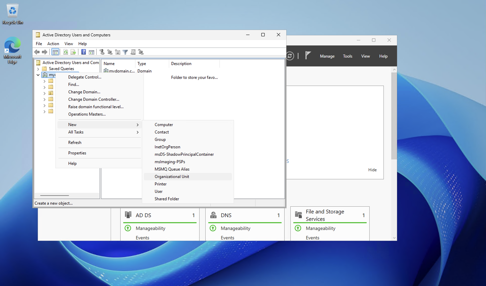
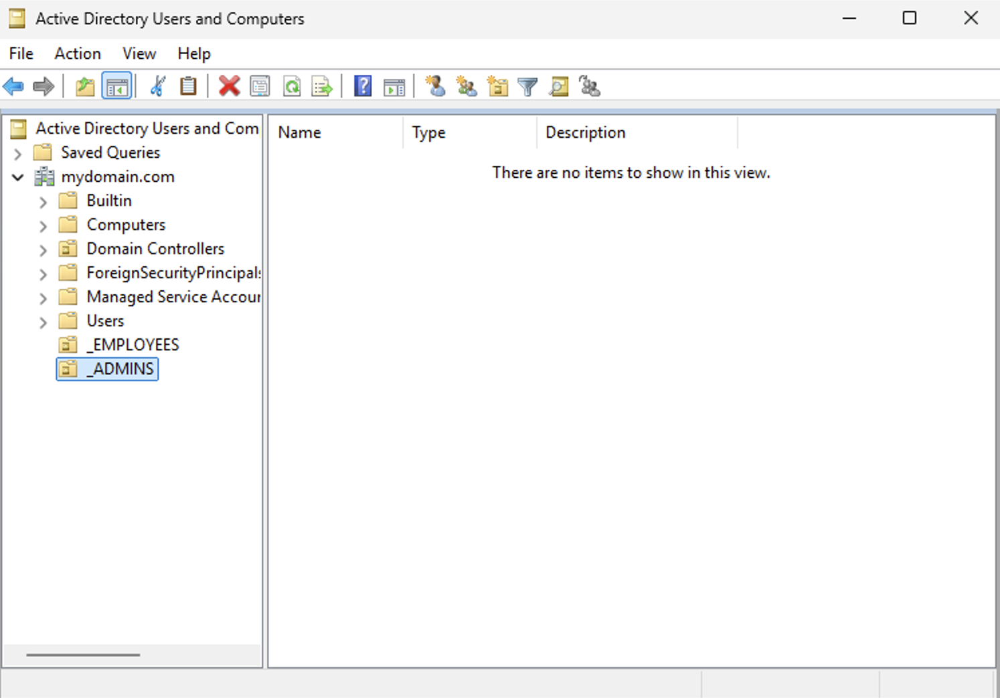
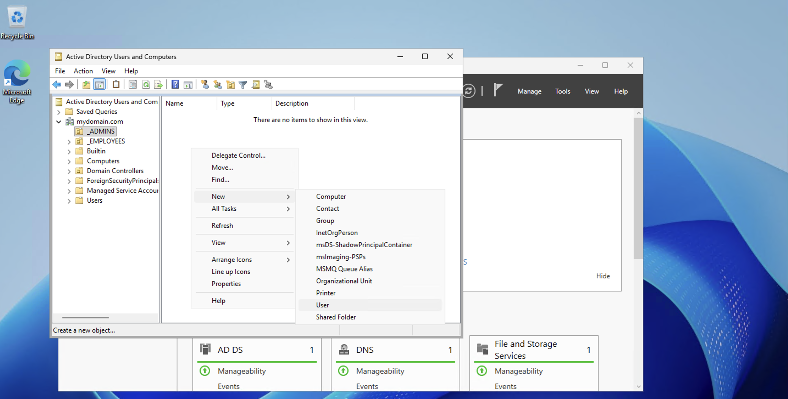
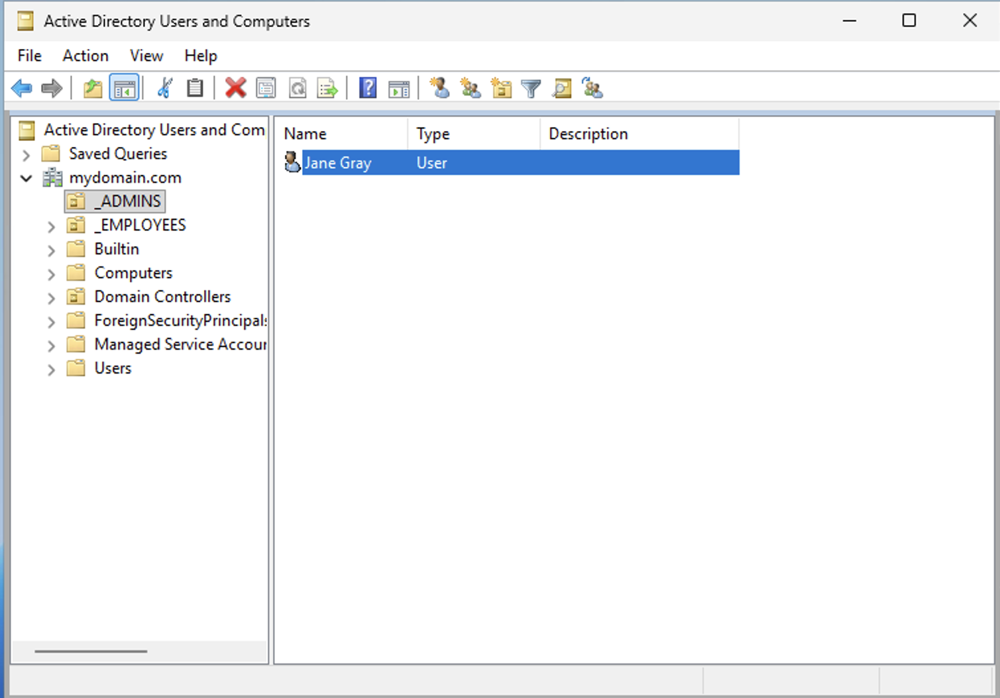
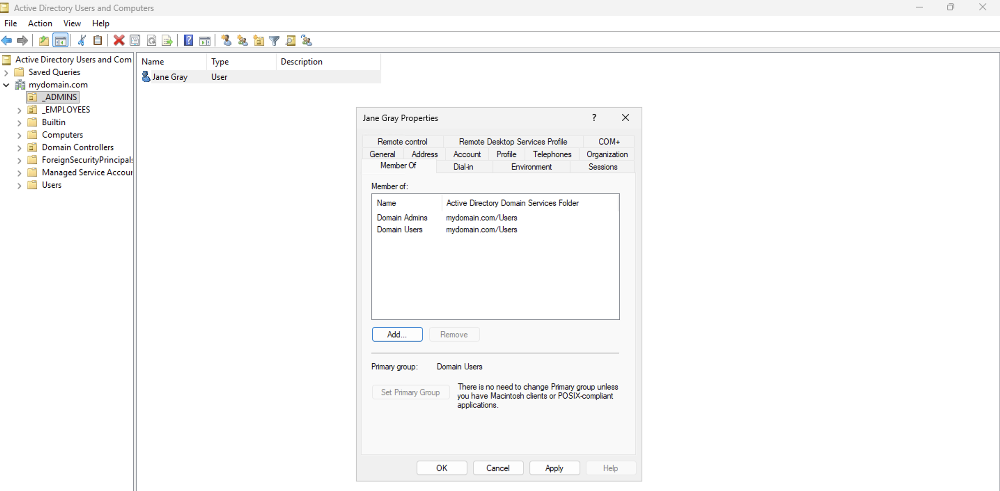
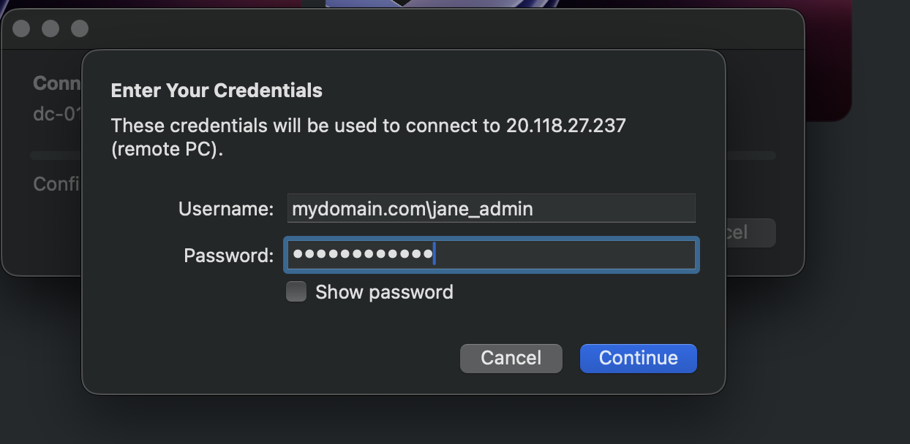

 

<h2>Creating Domain Admins and Domain Users</h2>

After deploying Active Directory, administrators can begin organizing the directory structure and creating domain users. In this lab, Organizational Units (OUs) are created to separate administrative accounts from regular employee accounts.

 

<h3>Creating Organizational Units</h3>

Within the <strong>Active Directory Users and Computers</strong> console, right-click the domain and navigate to:

<strong>New → Organizational Unit</strong>

Organizational Units allow administrators to logically organize users, computers, and other objects within the domain. This structure is commonly used in enterprise environments to separate departments, administrative accounts, and security policies.

 

<h3>Creating Admin and Employee Containers</h3>

Two Organizational Units are created to organize accounts within the environment.

The following OUs are created:

<ul>
<li><strong>_ADMINS</strong> – used to store domain administrator accounts</li>
<li><strong>_EMPLOYEES</strong> – used to store standard domain user accounts</li>
</ul>

This structure allows administrators to apply different security policies and permissions to different groups of users.

 

<h3>Creating a New Domain Administrator</h3>

Next, a domain administrator account is created inside the <strong>_ADMINS</strong> organizational unit.

Right-click the <strong>_ADMINS</strong> OU and select:

<strong>New → User</strong>

The administrator account is configured with the name <strong>Jane Gray</strong>.

 

<h3>Verifying the New Administrator Account</h3>

After completing the user creation wizard, the new account appears inside the <strong>_ADMINS</strong> organizational unit.

At this stage, the account exists in Active Directory but does not yet have administrative privileges.

 

<h3>Granting Domain Administrator Privileges</h3>

To grant administrative permissions, the user must be added to the <strong>Domain Admins</strong> security group.

Open the user properties and navigate to the <strong>Member Of</strong> tab.

The account is added to the following groups:

<ul>
<li>Domain Admins</li>
<li>Domain Users</li>
</ul>

Membership in the <strong>Domain Admins</strong> group provides full administrative control across the Active Directory domain.

 

<h3>Logging in with the New Domain Administrator</h3>

After the administrator account is created, it can be used to log into domain-joined systems. The login format uses the domain name followed by the username.

Example login format:

<pre>
mydomain.com\jane_admin
</pre>

Successful authentication confirms that the Active Directory domain controller is functioning correctly and that domain accounts can authenticate to systems within the environment.

 

<h3>Lab Outcome</h3>

At this stage the Active Directory environment now includes:

<ul>
<li>A functional Domain Controller</li>
<li>Organizational Units for administrative and employee accounts</li>
<li>A domain administrator account</li>
<li>Working domain authentication</li>
</ul>

This environment can now be expanded by joining client machines to the domain and generating additional user accounts to simulate a real enterprise network.

